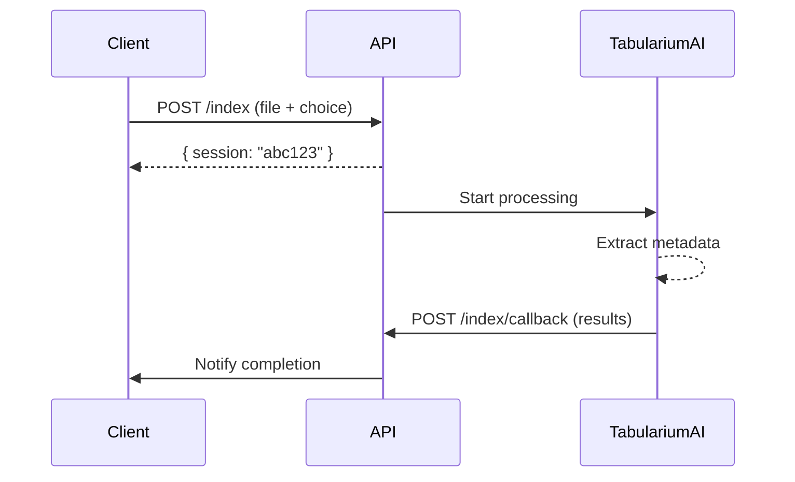

# AI Agent Core

> Open-source Node.js framework for building document processing agents powered by TabulariumAI

[](./TESTING_GUIDE.md)
[](https://www.typescriptlang.org/)
[](LICENSE)

---

## 🚀 Quick Start

```bash
# Clone the repository
git clone https://github.com/TabulariumAI/ai_agent_core.git
cd ai_agent_core

# Install dependencies
npm install

# Configure environment
cp .env .env.local
# Edit .env.local with your API key

# Run tests
npm test

# Start the server
npm start
```

Server runs on **http://localhost:3000**

---

## 🎯 What is AI Agent Core?

AI Agent Core is a **TypeScript/Node.js framework** for building document processing workflows:

- 📄 **Document Indexing** - Extract metadata (names, dates, amounts)
- 💰 **Fee Calculation** - Compute recording fees automatically
- 🔒 **Auto-Redaction** - Detect and remove sensitive data (SSN, DOB)
- 📝 **Automated Recording** - End-to-end document recording workflow
- ✍️ **Endorsements** - Generate official stamps and certifications

Built specifically for **county recorders**, **title companies**, and **government agencies**.

---

## ✨ Features

- ✅ **8 Pre-built Workflows** - Index, Calc, Redact, AutoRedact, AutoRecord, Provision, Endorse, Reprocess
- ✅ **RESTful API** - Clean REST endpoints with multipart file upload
- ✅ **TypeScript** - Full type safety with interfaces and schemas
- ✅ **Clean Architecture** - Domain-driven design with dependency injection
- ✅ **Async Callbacks** - Handle long-running AI processing
- ✅ **98% Test Coverage** - Comprehensive Jest integration tests
- ✅ **OpenAPI Spec** - Swagger documentation included

---

## 📖 Documentation

| Document | Description |
|----------|-------------|
| [API_DOCUMENTATION.md](./API_DOCUMENTATION.md) | Complete API reference with examples |
| [TESTING_GUIDE.md](./TESTING_GUIDE.md) | Testing instructions and test coverage |
| [CREDENTIALS_SETUP.md](./CREDENTIALS_SETUP.md) | Getting TabulariumAI credentials |
| [openapi.yaml](./openapi.yaml) | OpenAPI/Swagger specification |

---

## 🔧 Installation

### Prerequisites

- **Node.js** 20+ (LTS recommended)
- **npm** 9+ or **yarn** 1.22+
- **TabulariumAI API Key** (get from https://tabulariumai.com)

### Setup

```bash
# Install dependencies
npm install

# Configure environment
cp .env .env.local

# Edit .env.local
nano .env.local
```

**Required Environment Variables:**

```env
API_KEY="your-org-id:your-api-key"
CALLBACK_URL="http://localhost:3000/callback"
SESSION_URL="https://api.tabulariumai.com/v1"
INDEX_URL="https://api.tabulariumai.com/v1"
COMPUTE_URL="https://api.tabulariumai.com/v1"
# ... (see .env for all variables)
```

---

## 🎮 Usage

### Start the Server

```bash
npm start
# Server running on http://localhost:3000
```

### Development Mode (Auto-reload)

```bash
npm run dev
```

### Run Tests

```bash
npm test              # Run all tests
npm run test:watch    # Watch mode
```

---

## 📡 API Examples

### 1. Index a Document

Extract metadata from a deed:

```bash
curl -X POST http://localhost:3000/index \
  -F "file=@deed.pdf" \
  -F 'choice={"items":[{"service":"Recognition","level":3}]}'
```

**Response:**
```json
{
  "session": "abc123-session-id"
}
```

### 2. Calculate Fees

Calculate recording fees:

```bash
curl -X POST http://localhost:3000/calc \
  -F "file=@mortgage.pdf" \
  -F 'choice={"items":[{"service":"Compute","level":2}]}'
```

### 3. Auto-Redact Sensitive Data

Automatically redact SSN, DOB, etc:

```bash
curl -X POST http://localhost:3000/autoredact \
  -F "file=@document.pdf" \
  -F 'choice={"items":[{"service":"AutoRedact","level":3}]}'
```

### 4. Full Automated Recording

Complete end-to-end workflow:

```bash
curl -X POST http://localhost:3000/autorecord \
  -F "file=@deed.pdf" \
  -F 'choice={"items":[{"service":"AutoRecord","level":3}]}'
```

---

## 🏗️ Architecture

```
src/
├── core/              # Domain entities & interfaces
│   ├── entities/      # Business objects (MetaData, Choice, etc.)
│   └── interfaces/    # Service contracts
├── application/       # Use cases (business logic)
│   └── useCases/      # Workflow implementations
├── infrastructure/    # External service clients
│   ├── aiclients/     # TabulariumAI API clients
│   └── services/      # Supporting services
├── api/               # REST controllers
│   └── controllers/   # Endpoint handlers
└── di/                # Dependency injection setup
```

**Design Principles:**
- 🎯 **Clean Architecture** - Separation of concerns
- 💉 **Dependency Injection** - Using TypeDI
- 🧪 **Testable** - All layers isolated and mockable
- 📝 **Type-Safe** - Full TypeScript coverage

---

## 🔄 Workflow Lifecycle



---

## 🧪 Testing

### Test Results

- ✅ **50 out of 51 tests passing** (98% success rate)
- ⚡ Execution time: ~2.4 seconds
- 📊 Coverage: All 8 workflows tested

### Run Tests

```bash
npm test                    # Run all tests
npm test -- --coverage      # With coverage
npm test -- --verbose       # Detailed output
```

### Test a Specific Workflow

```bash
npm test -- src/tests/integration/indexController.test.ts
```

See [TESTING_GUIDE.md](./TESTING_GUIDE.md) for complete testing documentation.

---

## 🌟 Available Workflows

| Workflow | Endpoint | Description |
|----------|----------|-------------|
| **Index** | `POST /index` | Extract metadata (names, dates, amounts) |
| **Calc** | `POST /calc` | Calculate recording fees |
| **Redact** | `POST /redact` | Manual redaction with AI hints |
| **AutoRedact** | `POST /autoredact` | Fully automated redaction |
| **AutoRecord** | `POST /autorecord` | Complete recording workflow |
| **Provision** | `POST /provision` | Document provisioning |
| **Endorse** | `POST /endorse` | Add official endorsements |
| **Reprocess** | `POST /reprocess` | Re-analyze segments |

Each workflow has a corresponding `/callback` endpoint for receiving results.

---

## 🎨 Example Use Cases

### County Recorder Office

```javascript
// Automate intake of deeds
const session = await axios.post('/autorecord', {
  file: uploadedDeed,
  choice: { items: [{ service: 'AutoRecord', level: 3 }] }
});

// Results include:
// - Extracted grantor/grantee
// - Calculated fees
// - Auto-redacted sensitive data
// - Recording endorsement
```

### Title Company

```javascript
// Extract property information
const metadata = await processDocument('/index', deed);

// Analyze chain of title
const chain = metadata.chain;

// Calculate title fees
const fees = await processDocument('/calc', deed);
```

### Government Agency

```javascript
// Bulk redaction for public records
await Promise.all(
  documents.map(doc =>
    processDocument('/autoredact', doc)
  )
);
```

---

## 🔐 Security

- ✅ API key authentication
- ✅ HTTPS/TLS for production
- ✅ Secure callback verification
- ✅ File type validation
- ✅ Input sanitization

See [CREDENTIALS_SETUP.md](./CREDENTIALS_SETUP.md) for security best practices.

---

## 🛠️ Development

### Project Scripts

```bash
npm start           # Start production server
npm run dev         # Development with auto-reload
npm run build       # Compile TypeScript
npm test            # Run tests
npm run test:watch  # Test watch mode
```

### Adding a New Workflow

1. Create use case in `src/application/useCases/`
2. Create controller in `src/api/controllers/`
3. Add to `src/index.ts` controller list
4. Write tests in `src/tests/integration/`

### Code Style

- **TypeScript** - Strict mode enabled
- **ESLint** - Code linting
- **Prettier** - Code formatting
- **Jest** - Testing framework

---

## 📦 Dependencies

### Core Dependencies

- **express** - Web server framework
- **routing-controllers** - Decorator-based routing
- **typedi** - Dependency injection
- **class-validator** - Input validation
- **multer** - File upload handling

### Dev Dependencies

- **typescript** - Type system
- **jest** & **ts-jest** - Testing
- **supertest** - API testing
- **@types/\*** - Type definitions

---

## 🤝 Contributing

Contributions welcome! Please:

1. Fork the repository
2. Create a feature branch (`git checkout -b feature/amazing`)
3. Write tests for new features
4. Ensure all tests pass (`npm test`)
5. Submit a pull request

---

## 📄 License

This project is licensed under the **MIT License**.

---

## 🔗 Links

- **Website:** https://tabulariumai.com
- **Platform:** https://tabulariumai.com/platform
- **Resources:** https://tabulariumai.com/resources
- **GitHub:** https://github.com/TabulariumAI/ai_agent_core
- **Support:** support@tabulariumai.com

---

## 📞 Support

### Getting Help

- 📖 Read the [API Documentation](./API_DOCUMENTATION.md)
- 🧪 Check [Testing Guide](./TESTING_GUIDE.md)
- 🔐 Setup [Credentials](./CREDENTIALS_SETUP.md)
- 🐛 Report issues on GitHub
- 💬 Contact support@tabulariumai.com

---

## 🏆 Acknowledgments

Built with ❤️ for the document recording industry.

Special thanks to:
- TabulariumAI team for the platform
- OpenGov community
- Contributors and testers

---

**Ready to automate your document workflows?**

```bash
npm install
npm start
```

🚀 **Let's build something amazing!**
